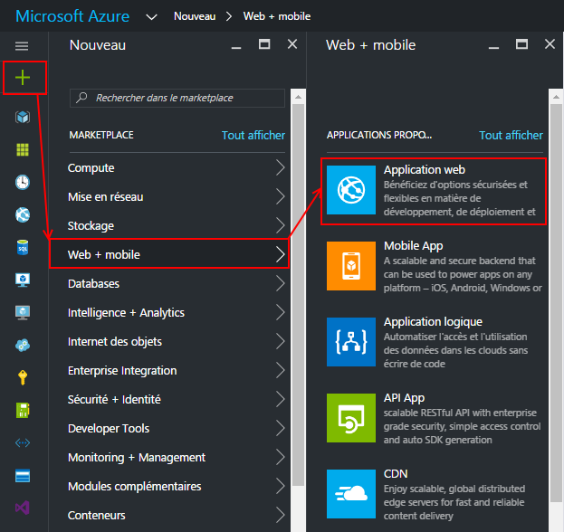
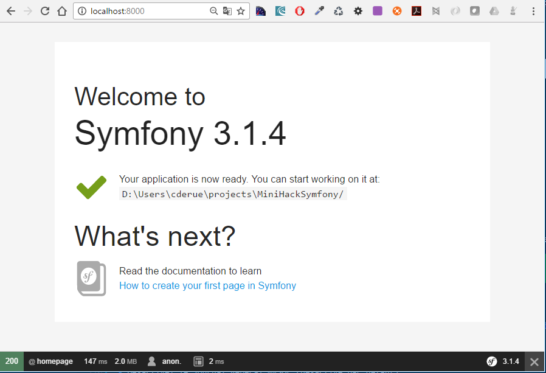

# Microsoft Azure App Service
Pour ce mini-hack, je vous propose d'utiliser Microsoft Azure App Service pour déployer une application PHP Symfony3.
Ce tutoriel se déroule en 5 phases :

1. La vérification des prérequis nécessaires
2. La création d'une application web Azure avec [Microsoft Azure App Service](https://azure.microsoft.com/fr-fr/services/app-service/)
3. La création et le déploiement d'une application [Symfony3](https://symfony.com/) sur Microsoft Azure
4. L'ajout d'une base de données MySQL à une application web Azure avec [Azure App Service MySQL in-app](https://blogs.msdn.microsoft.com/appserviceteam/2016/08/18/announcing-mysql-in-app-preview-for-web-apps/)
5. Le paramétrage d'une notification de déploiement avec [Microsoft Azure Functions](https://azure.microsoft.com/fr-fr/services/functions/)

## 1) Prérequis
- L'un des éditeurs de code avancé suivant : 
    - [Visual Studio Code](https://code.visualstudio.com)
    - [Atom](https://atom.io/)
    - [Sublime Text](https://www.sublimetext.com/)
- Un compte Microsoft Azure :
    - [Microsoft Azure](https://azure.microsoft.com/fr-fr/free/)
- Une distribution récente de PHP 5 ou 7 :
    - [PHP 5.6](https://secure.php.net/downloads.php#v5.6.26)
    - [PHP 7.0](https://secure.php.net/downloads.php#v7.0.11)

## 2) Création d'une nouvelle application web avec Azure App Service

### 2.1) Quelques mots sur Azure App Service

Azure App Service est un service de plateforme ou Paas (Platform as a Service) qui permet de créer des applications web et mobiles dans le cloud Azure.

### 2.2) Créer une nouvelle application web avec Azure App Service

Pour créer une nouvelle application web depuis le [portail Azure](https://portal.azure.com) :

- Cliquez sur Nouveau > Web + mobile > Application web



- Complétez ensuite les premières informations nécessaires :
    - Nom de l'application : à vous de choisir
    - Abonnement Azure (dans le cas où vous auriez plusieurs abonnements Azure)
    - Groupe de ressources : un nouveau groupe de ressource pour le mini-hack sera parfait
        
       

- Créez un [plan Azure App Service](https://azure.microsoft.com/fr-fr/documentation/articles/azure-web-sites-web-hosting-plans-in-depth-overview/) pour l'application web :
    - Cliquez sur [+] Créer nouveau
    - Saisissez le nom du plan App Service
    - Sélectionnez un emplacement : pour ce mini-hack, sélectionnez l'Europe occidentale (West Europe)
    - Cliquez sur Niveau de tarification puis cliquez sur Afficher tout pour afficher davantage d'options de tarification, telles que Gratuit et Partagé
    - Sélectionnez le niveau de tarification F1 (gratuit) pour le service  puis cliquez sur Sélectionner
    - Valider l'ensemble en cliquant sur OK

        
 
- Renseignez enfin les dernières informations nécessaires :
    - App Insights : laisser désactivé cette fonctionnalité qui n'est pas dans le périmètre de ce mini-hack
    - Epingler au tableau de bord : conseillé pour accéder plus facilement à votre service
    - Cliquez sur le bouton Créer pour lancer la création de l'appplication web
     


*Une fois la création terminée, le portail Azure affiche une vue d'ensemble de l'application web.*

- Cliquez sur le lien vers l'URL de l'application web


*Le navigateur affiche une page par défault indiquant que l'application web a été créée avec succès.*


## 3) Création et déploiement d'une application PHP Symfony3

## 3.1) Quelques mots sur Symfony3

Symfony3 est la dernière version du framework Symfony de SensioLabs. 
Ce framework permet de créer des applications PHP allant du simple blog aux grandes applications critiques d'entreprise.
Symfony permet de programmer avec une approche orientée composant en permettant ainsi au développeur d'utiliser toute ou partie du framework dans la construction d'une application.

## 3.2) Créer une nouvelle application Symfony3

### 3.2.1) Installer Symfony Installer

Pour ce faire, nous allons utiliser un programme d'installation dédié nommé __Symfony Installer__.
Les deux prochaines sous-sections montrent comment récupérer le programme __Symfony Installer__ respectivement sous Mac OS X (ou Linux) et Windows.

#### 3.2.1.1) Sous Mac OS X ou Linux

```bash
$ sudo curl -LsS https://symfony.com/installer -o /usr/local/bin/symfony
$ sudo chmod a+x /usr/local/bin/symfony
```

#### 3.2.1.2) Sous Windows
```bash
c:\> php -r "file_put_contents('symfony', file_get_contents('https://symfony.com/installer'));"
```

- Ajoutez le fichier __symfony__ dans la variable d'environnement __PATH__ pour pouvoir appeler ce programme depuis n'importe quel répertoire.

### 3.2.2) Démarrer un nouveau projet d'application Symfony

Les deux prochaines sous-sections montrent comment démarrer un nouveau projet d'application Symfony respectivement sous Mac OS X (ou Linux) et Windows.

#### 3.2.2.1) Sous Mac OS X ou Linux
```bash
$ symfony new <my_project_name>
```

#### 3.2.2.2) Sous Windows
```bash
$ php symfony new <my_project_name>
```

Après quelques secondes, la nouvelle application Symfony est prête pour être exécutée en local.
Pour ce faire, suivez les instructions indiquées dans le terminal comme le montre la figure ci-dessous (ignorez la configuration du fichier parameters.yml) :


Le navigateur affiche alors la page montrée dans la figure ci-dessous :



### 3.3) Déployer une application Symfony sur Azure

Pour déployer une application web sur Azure, il faut au préalable retourner sur l'application web Azure créée dans la phase 1 
pour configurer la souce de déploiement :
- Rendez-vous sur le [portail Azure](http://portal.azure.com)
- Cliquez sur l'application web (épinglée normalement sur le tableau de bord du portail)
- Dans la section Déploiement des applications, cliquez sur Options de déploiement
- Cliquez sur Choisir la source
- Sélectionnez Référentiel Git local
- Cliquez sur OK pour valider le choix de la source de déploiement
    


L'application web dispose désormais d'un URL de clonage Git accessible depuis la vue d'ensemble de l'application comme le montre la figure suivante :


Si vous n'avez jamais déployé d'application web Azure à partir d'un référentiel Git local, il est nécessaire de renseigner les informations d'identification du référentiel Git local :
    - Dans la section Déploiement des applications, cliquez sur Informations d'identification de déploiement
    - Saisissez un nom d'utilisateur
    - Saisissez un mot de passe
    - Confirmez le mot de passe
    - Cliquez sur Enregister pour valider les informations d'identification
        


Maintenant que la source de déploiement est entièrement configurée, il est temps de déployer l'application PHP Symfony3 créée dans la phase 2. 
Pour y parvenir, il est nécessaire d'initier un dépôt Git local au niveau du projet d'application Symfony puis d'ajouter le référentiel distant instancié sur Azure.
  d'ajouter au projet d'application Symfony3 deux fichiers 
Ces deux fichiers sont fournis directement dans le répertoire Sources du mini-hack.  

Ensuite, nous allons ajouté deux fichiers nommés web.config et .deployment au projet d'application. 

### Le fichier web .config 
Ce fichier permet de définir les règles de réécriture des URL comme vous le feriez habituellement dans un fichier .htaccess. Ces règles sont nécessaires 

### Le fichier .deployment
Ce fichier permet de scripter le déploiement de l'application. Le nom du fichier est important pour que le déploiement fonctionne (n'oubliez paz le point devant le nom).
Son utilisation n'est pas systématique lorsque l'on déploie des application web avec Azure App Service.
Néanmoins, pour une application qui utilise le programme composer pour installer les dépendances du projet d'application, le fichier .deployment est obligatoire.
Le fichier .deployment 


- Copiez les fichiers web.config et .deployment à la racine du projet d'application Symfony3
- Exécutez la commande suivante depuis un terminal :
```bash
$ git add .
```
- Exécutez la commande suivante depuis un terminal :
```bash
$ git commit -m "Déploiement de l'application PHP Symfony3"
```
- Exécutez la commande suivante depuis un terminal :
```bash
$ git push azure master
```


## 3) Ajouter une base de données MySQL dans une application web avec Azure App Service MySQL in-app

MySQL in-app (Preview) feature enables running MySql natively on Azure App Service platform.You don’t need to provision a database explicitly as during the creation of the web app when using this feature,  we take care of enabling it if you select “MySQL in-app(Preview)” during creation or if the feature is turned ON for existing web app. To understand what MySQL in-app means , I have highlighted core functionality supported with the preview release of the feature:

Support PHP , MYSQL applications like WordPress, Joomla , Drupal etc .
MySQL server running on the same instance side by side with your web server hosting the site. This will boost performance of your application
Storage is shared between both MySQL and your web app files. Note with Free and Shared plans you may hit our quota limits when using the site based on the actions you perform . Check out quota limitations for Free and Shared plans.
You can turn on Slow query logging and general logging for MySQL . Note that this can impact the site performance and should NOT always be turned ON . The logging feature will help investigation any application issues .
Go to your web app and select MySQL in-app(Preview) in the Menu blade on the right. You can use the setting here to manage your MySQL in-app feature , turn on logging , access PHPmyadmin etc.
- Activez MySQL In App
- Désactivez le journal des requêtes lentes MySQL (désactivé par défaut)
- Désactivez le journal général MySQL (désactivé par défaut)
- Cliquez sur Enregistrer pour enregistrer les paramètres MySQL In App
- Cliquez sur Gérer pour ouvrir phpMyAdmin commme le montre la figure ci-dessous :


Le navigateur affiche la page de connexion à phpMyAdmin et demande à  commme le montre la figure ci-dessous :
A cet instant précis, nous ne connaissons pas l'identifiant utilisateur et le mot de passe générés par Azure pour se connecter à 


- Dans la page de connexion de phpMyAdmin, saisissez le nom d'utilisateur et le mot de passe


La base de données créée par Azure se nomme azuredb commme le montre la figure ci-dessous :

Les répertoire Sources de ce min-hack contient un fichier nommé get_mysql_connection.php et qui permet de récupérer l'identifiant utilisateur et le mot de passe.
Copiez le fichier get_mysql_connection.php à la racine du projet d'application Symfony3 et déployer l'application comme cela à été vu dans la phase 3.
N'oubliez donc pas de faire le commit du fichier et de pousser ce commit vers le dépôt Git distant sur Azure.
Une fois le déploiement terminé, accédez à l'URL du fichier depuis un navigateur pour afficher l'identifiant utilisateur et le mot de passe

Vous pouvez maintenant commencer à utiliser la fonctionnalité de gestion des tâches de l'application. Les tâches créées seront stockées dans la base de données MySQL.

## 4) Générer une notification de déploiement avec Azure Functions


Pensez à valider votre mini-hack, il y a des cadeaux à gagner !

## Pour aller plus loin

Ces parties sont optionnelles dans le cadre du mini-hack, mais voici quelques idées pour aller plus loin :

