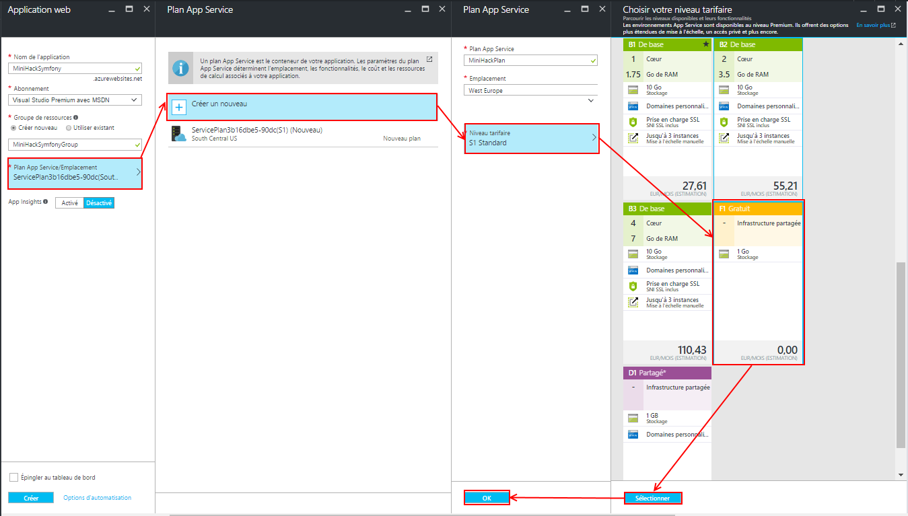
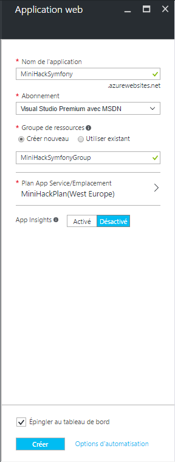
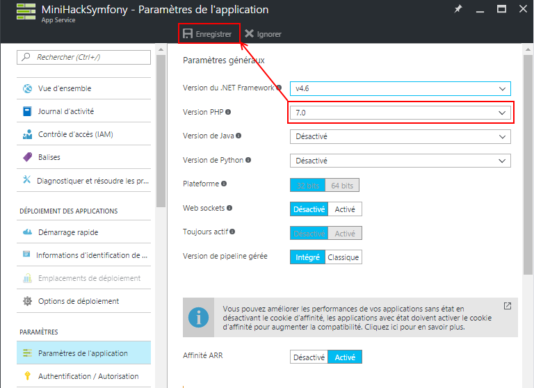
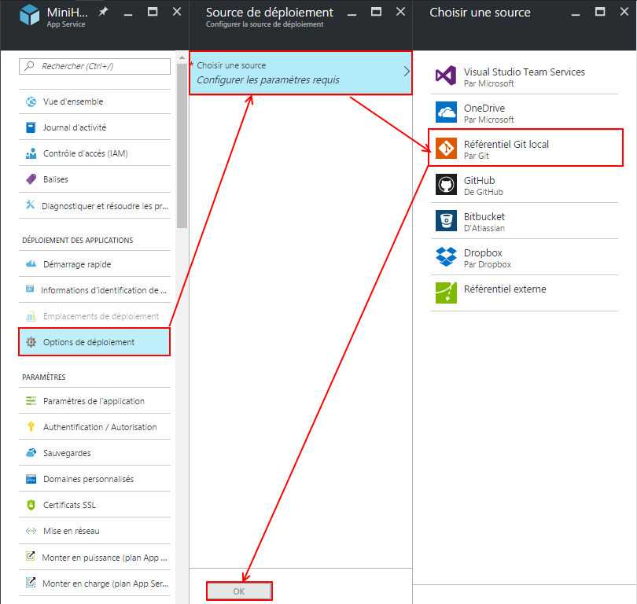

# Microsoft Azure App Service
Pour ce mini-hack, je vous propose d'utiliser Microsoft Azure App Service pour déployer une application PHP Symfony3.
De plus, vous verrez comment utiliser Azure Functions pour générer un notification de déploiement.
Ce tutoriel se déroule en 4 phases :

1. La vérification des prérequis nécessaires
2. La création d'une application web Azure avec [Microsoft Azure App Service](https://azure.microsoft.com/fr-fr/services/app-service/)
3. La création et le déploiement d'une application [Symfony3](https://symfony.com/) sur Microsoft Azure
4. Le paramétrage d'une notification de déploiement avec [Microsoft Azure Functions](https://azure.microsoft.com/fr-fr/services/functions/)

## 1) Prérequis
- L'un des éditeurs de code avancé suivant : 
    - [Visual Studio Code](https://code.visualstudio.com)
    - [Atom](https://atom.io/)
    - [Sublime Text](https://www.sublimetext.com/)
- Un compte Microsoft Azure :
    - [Microsoft Azure](https://azure.microsoft.com/fr-fr/free/)
- Git :
    - [Git pour Windows](https://git-scm.com/download/win)
    - [Git pour Mac OS X ou Linux](https://git-scm.com/book/fr/v1/D%C3%A9marrage-rapide-Installation-de-Git)
- Une distribution récente de PHP 5 ou 7 :
    - [PHP 5.6](https://secure.php.net/downloads.php#v5.6.26)
    - [PHP 7.0](https://secure.php.net/downloads.php#v7.0.11)

## 2) Création d'une nouvelle application web avec Azure App Service

### 2.1) Quelques mots sur Azure App Service

Azure App Service est un service de plateforme ou Paas (Platform as a Service) qui permet de créer des applications web et mobiles dans le cloud Azure.

### 2.2) Créer une nouvelle application web avec Azure App Service

Pour créer une nouvelle application web depuis le [portail Azure](https://portal.azure.com) :

- Cliquez sur __Nouveau > Web + mobile > Application web__


- Complétez ensuite les premières informations nécessaires :
    - Saisissez le nom de l'application : à vous de choisir (attention de ne pas prendre un nom déjà pris)
    - Sélectionnez l'abonnement Azure (dans le cas où vous auriez plusieurs abonnements Azure)
    - Sélectionnez l'option __Nouveau__ pour le groupe de ressources et saisissez un nom pour ce groupe de ressources (attention de ne pas prendre un nom déjà pris)
        
       

- Créez un [plan Azure App Service](https://azure.microsoft.com/fr-fr/documentation/articles/azure-web-sites-web-hosting-plans-in-depth-overview/) pour l'application web :
    - Cliquez sur [+] __Créer nouveau__
    - Saisissez un nom pour le nouveau plan App Service (attention de ne pas prendre un nom déjà pris)
    - Sélectionnez un emplacement : pour ce mini-hack, sélectionnez l'Europe occidentale (West Europe)
    - Cliquez sur __Niveau de tarification__ puis cliquez sur __Afficher tout__ pour afficher davantage d'options de tarification, telles que __Gratuit__ et __Partagé__
    - Sélectionnez le niveau de tarification __F1 (gratuit)__ pour le service  puis cliquez sur __Sélectionner__
    - Valider l'ensemble en cliquant sur __OK__

        
 
- Renseignez enfin les dernières informations nécessaires :
    - App Insights : laisser désactivée cette fonctionnalité qui n'est pas dans le périmètre de ce mini-hack
    - Epingler au tableau de bord : conseillé pour accéder plus facilement à votre service
    - Cliquez sur le bouton __Créer__ pour lancer la création de l'appplication web
     


*Une fois la création terminée, le portail Azure affiche une vue d'ensemble de l'application web.*

- Cliquez sur le lien vers l'URL de l'application web


*Le navigateur affiche une page par défault indiquant que l'application web a été créée avec succès.*


### 2.3) Configurer la version de PHP

Azure App Service permet de paramétrer la version de PHP utilisée pour l'exécution d'une application PHP.
Nous allons maintenant paramétrer l'application web Azure pour qu'elle utilise PHP en version 7.

- Dans la section __Paramètres__ de l'application web, cliquez sur __Paramètres de l'application__
- Sélectionnez la version 7 de PHP
- Cliquez sur __Enregistrer__ pour valider les modifications

   

## 3) Création et déploiement d'une application PHP Symfony3

### 3.1) Quelques mots sur Symfony3

Symfony3 est la dernière version courante du framework Symfony de SensioLabs. 
Ce framework permet de créer des applications PHP allant du simple blog aux grandes applications critiques d'entreprise.
Symfony permet de programmer avec une approche orientée composant en permettant ainsi au développeur d'utiliser toute ou partie du framework dans la construction d'une application.

### 3.2) Créer une nouvelle application Symfony3

#### 3.2.1) Installer Symfony Installer

Pour ce faire, nous allons utiliser un programme d'installation dédié nommé __Symfony Installer__.

- Pour installer __Symfony Installer__, suivez les instructions ci-dessous en fonction de votre système d'exploitation :

```bash
# Sous Mac OS X ou Linux
$ sudo curl -LsS https://symfony.com/installer -o /usr/local/bin/symfony
$ sudo chmod a+x /usr/local/bin/symfony

# Sous Windows
c:\> php -r "file_put_contents('symfony', file_get_contents('https://symfony.com/installer'));"
```

Note pour les utilsateurs sous Windows :
- Ajoutez le fichier __symfony__ dans la variable d'environnement __PATH__ pour pouvoir appeler ce programme depuis n'importe quel répertoire.

#### 3.2.2) Démarrer un nouveau projet d'application Symfony

- Pour démarer un nouveau projet d'application Symfony, suivez les instructions ci-dessous en fonction de votre système d'exploitation :

```bash
# Sous Mac OS X ou Linux
$ symfony new <my_project_name>

# Sous Windows
$ php symfony new <my_project_name>
```

*Après quelques secondes, la nouvelle application Symfony est prête pour être exécutée en local.*

- Pour lancer l'exécution de l'application, suivez les instructions indiquées dans le terminal (ignorez la configuration du fichier parameters.yml) :


*Le navigateur affiche alors la page montrée dans la figure ci-dessous :*


### 3.3) Configurer le déploiement d'une application web sur Azure

Pour déployer une application web sur Azure, il faut au préalable retourner sur l'application web Azure créée dans la section 2. 
Pour configurer la souce de déploiement :
- Rendez-vous sur le [portail Azure](http://portal.azure.com)
- Cliquez sur l'application web (épinglée normalement sur le tableau de bord du portail)
- Dans la section __Déploiement des applications__ de l'application web, cliquez sur __Options de déploiement__
- Cliquez sur __Choisir la source__
- Sélectionnez __Référentiel Git local__
- Cliquez sur __OK__ pour valider le choix de la source de déploiement
    


*L'application web dispose désormais d'une URL de clonage Git accessible depuis la vue d'ensemble de l'application comme le montre la figure suivante :*


Si vous n'avez jamais déployé d'application web Azure à partir d'un référentiel Git local, il est nécessaire de renseigner les informations d'identification du référentiel Git local :
    - Dans la section __Déploiement des applications__ de l'application web, cliquez sur __Informations d'identification de déploiement__
    - Saisissez un nom d'utilisateur
    - Saisissez un mot de passe
    - Confirmez le mot de passe
    - Cliquez sur __Enregister__ pour valider les informations d'identification
        


### 3.4) Déployer une application Symfony sur Azure

Maintenant que la source de déploiement est entièrement configurée, il est temps de déployer l'application PHP Symfony3 créée dans la section 3.
Juste avant cela, intéressons nous aux 3 fichiers contenus dans le répertoire __Sources__ du mini-hack :
- __web.config__
- __.deployment__
- __deploy.sh__

*Le fichier web .config :*
Ce fichier permet de définir les règles de réécriture des URL comme vous le feriez habituellement dans un fichier __.htaccess__. 
Ces règles sont nécessaires pour que l'application se comporte correctement lors de la navigation.

*Le fichier .deployment :*
Ce fichier permet de personnaliser le déploiement d'une application web sur Azure avec Azure App Service.
Dans cet exemple, le fichier __.deployment__ contient une instruction de configuration pour que le fichier __deploy.sh__ soit exécuté lors du déploiement.

*Le fichier deploy.sh :*
Ce fichier écrit en shell permet de scripter le déploiement de l'application. Le nom du fichier est important pour que le déploiement fonctionne (n'oubliez paz le point devant le nom).
Son utilisation n'est pas systématique lorsque l'on déploie des application web avec Azure App Service.
Néanmoins, pour une application PHP qui utilise le programme __composer__ pour installer les dépendances du projet d'application, le fichier __.deployment__ est obligatoire.

Pour procéder au déploiement de l'application :
- Copiez les fichiers __web.config__, __.deployment__ et __deploy.sh__ à la racine du projet d'application Symfony
- Exécutez les commandes suivantes depuis un terminal :

```bash
$ git init
$ git remote add azure <url_de_clonage_git_de_l'application_web>
$ git add .
$ git commit -m "Déploiement de l'application PHP Symfony3" 
$ git push azure master
```

*Le déploiement dure quelques minutes.*
*Une fois le déploiement terminé, lancez de nouveau l'application web Azure dans un navigateur pour observer le résultat.*


C'est terminé ! Pensez à valider votre mini-hack, il y a des cadeaux à gagner !

## Pour aller plus loin

Ces parties sont optionnelles dans le cadre du mini-hack, mais voici quelques idées pour aller plus loin :

- [Ajouter une base de données MySQL avec MySQL In App](MySQL in-app/README.md)
- [Ajouter une notification de déploiement par email avec Azure Functions et SendGrid](Azure Functions/README.md)
- [Personnaliser le déploiement d'une application web Azure avec Kudu](https://azure.microsoft.com/en-us/documentation/videos/custom-web-site-deployment-scripts-with-kudu/)


