# Microsoft Azure App Service
Pour ce mini-hack, je vous propose d'utiliser Microsoft Azure App Service pour déployer une application PHP Symfony3.
De plus, vous verrez comment utiliser Azure Functions pour générer un notification de déploiement.
Ce tutoriel se déroule en 4 phases :

1. La vérification des prérequis nécessaires
2. La création d'une application web Azure avec [Microsoft Azure App Service](https://azure.microsoft.com/fr-fr/services/app-service/)
3. La création et le déploiement d'une application [Symfony3](https://symfony.com/) sur Microsoft Azure
4. Le paramétrage d'une notification de déploiement avec [Microsoft Azure Functions](https://azure.microsoft.com/fr-fr/services/functions/)

## 1) Prérequis
- L'un des éditeurs de code avancé suivant : 
    - [Visual Studio Code](https://code.visualstudio.com)
    - [Atom](https://atom.io/)
    - [Sublime Text](https://www.sublimetext.com/)
- Un compte Microsoft Azure :
    - [Microsoft Azure](https://azure.microsoft.com/fr-fr/free/)
- Git :
    - [Git pour Windows](https://git-scm.com/download/win)
    - [Git pour Mac OS X ou Linux](https://git-scm.com/book/fr/v1/D%C3%A9marrage-rapide-Installation-de-Git)
- Une distribution récente de PHP 5 ou 7 :
    - [PHP 5.6](https://secure.php.net/downloads.php#v5.6.26)
    - [PHP 7.0](https://secure.php.net/downloads.php#v7.0.11)

## 2) Création d'une nouvelle application web avec Azure App Service

### 2.1) Quelques mots sur Azure App Service

Azure App Service est un service de plateforme ou Paas (Platform as a Service) qui permet de créer des applications web et mobiles dans le cloud Azure.

### 2.2) Créer une nouvelle application web avec Azure App Service

Pour créer une nouvelle application web depuis le [portail Azure](https://portal.azure.com) :

- Cliquez sur __Nouveau > Web + mobile > Application web__


- Complétez ensuite les premières informations nécessaires :
    - Saisissez le nom de l'application : à vous de choisir (attention de ne pas prendre un nom déjà pris)
    - Sélectionnez l'abonnement Azure (dans le cas où vous auriez plusieurs abonnements Azure)
    - Sélectionnez l'option __Nouveau__ pour le groupe de ressources et saisissez un nom pour ce groupe de ressources (attention de ne pas prendre un nom déjà pris)
        
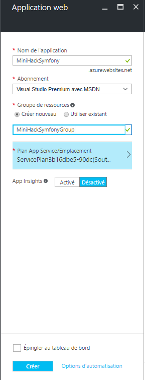       

- Créez un [plan Azure App Service](https://azure.microsoft.com/fr-fr/documentation/articles/azure-web-sites-web-hosting-plans-in-depth-overview/) pour l'application web :
    - Cliquez sur [+] __Créer nouveau__
    - Saisissez un nom pour le nouveau plan App Service (attention de ne pas prendre un nom déjà pris)
    - Sélectionnez un emplacement : pour ce mini-hack, sélectionnez l'Europe occidentale (West Europe)
    - Cliquez sur __Niveau de tarification__ puis cliquez sur __Afficher tout__ pour afficher davantage d'options de tarification, telles que __Gratuit__ et __Partagé__
    - Sélectionnez le niveau de tarification __F1 (gratuit)__ pour le service  puis cliquez sur __Sélectionner__
    - Valider l'ensemble en cliquant sur __OK__

        
 
- Renseignez enfin les dernières informations nécessaires :
    - App Insights : laisser désactivée cette fonctionnalité qui n'est pas dans le périmètre de ce mini-hack
    - Epingler au tableau de bord : conseillé pour accéder plus facilement à votre service
    - Cliquez sur le bouton __Créer__ pour lancer la création de l'appplication web
     


*Une fois la création terminée, le portail Azure affiche une vue d'ensemble de l'application web.*

- Cliquez sur le lien vers l'URL de l'application web

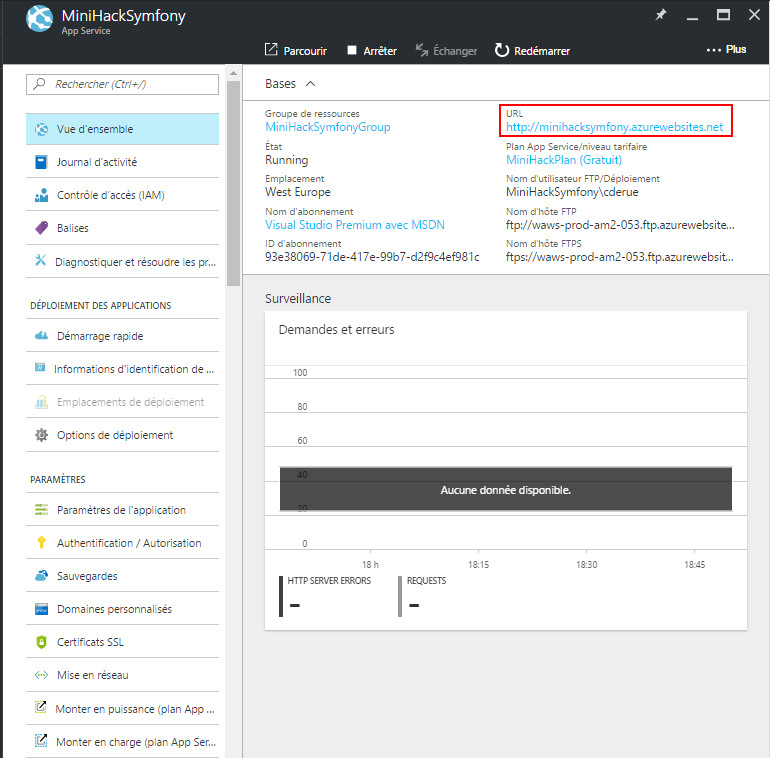

*Le navigateur affiche une page par défault indiquant que l'application web a été créée avec succès.*

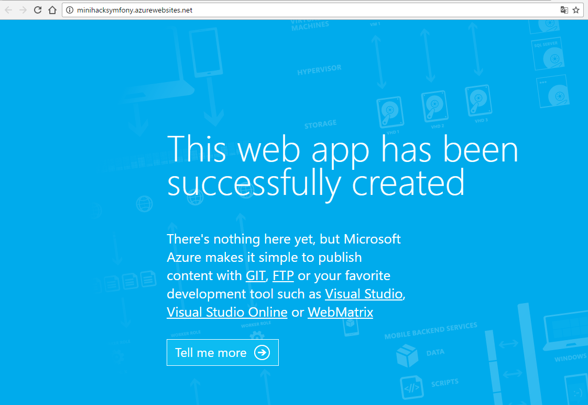

### 2.3) Configurer la version de PHP

Azure App Service permet de paramétrer la version de PHP utilisée pour l'exécution d'une application PHP.
Nous allons maintenant paramétrer l'application web Azure pour qu'elle utilise PHP en version 7.

- Dans la section __Paramètres__ de l'application web, cliquez sur __Paramètres de l'application__
- Sélectionnez la version 7 de PHP
- Cliquez sur __Enregistrer__ pour valider les modifications

   

## 3) Création et déploiement d'une application PHP Symfony3

### 3.1) Quelques mots sur Symfony3

Symfony3 est la dernière version courante du framework Symfony de SensioLabs. 
Ce framework permet de créer des applications PHP allant du simple blog aux grandes applications critiques d'entreprise.
Symfony permet de programmer avec une approche orientée composant en permettant ainsi au développeur d'utiliser toute ou partie du framework dans la construction d'une application.

### 3.2) Créer une nouvelle application Symfony3

#### 3.2.1) Installer Symfony Installer

Pour ce faire, nous allons utiliser un programme d'installation dédié nommé __Symfony Installer__.

- Pour installer __Symfony Installer__, suivez les instructions ci-dessous en fonction de votre système d'exploitation :

```bash
# Sous Mac OS X ou Linux
$ sudo curl -LsS https://symfony.com/installer -o /usr/local/bin/symfony
$ sudo chmod a+x /usr/local/bin/symfony

# Sous Windows
c:\> php -r "file_put_contents('symfony', file_get_contents('https://symfony.com/installer'));"
```

Note pour les utilsateurs sous Windows :
- Ajoutez le fichier __symfony__ dans la variable d'environnement __PATH__ pour pouvoir appeler ce programme depuis n'importe quel répertoire.

#### 3.2.2) Démarrer un nouveau projet d'application Symfony

- Pour démarer un nouveau projet d'application Symfony, suivez les instructions ci-dessous en fonction de votre système d'exploitation :

```bash
# Sous Mac OS X ou Linux
$ symfony new <my_project_name>

# Sous Windows
$ php symfony new <my_project_name>
```

*Après quelques secondes, la nouvelle application Symfony est prête pour être exécutée en local.*

- Pour lancer l'exécution de l'application, suivez les instructions indiquées dans le terminal (ignorez la configuration du fichier parameters.yml) :


*Le navigateur affiche alors la page montrée dans la figure ci-dessous :*


### 3.3) Configurer le déploiement d'une application web sur Azure

Pour déployer une application web sur Azure, il faut au préalable retourner sur l'application web Azure créée dans la section 2. 
Pour configurer la souce de déploiement :
- Rendez-vous sur le [portail Azure](http://portal.azure.com)
- Cliquez sur l'application web (épinglée normalement sur le tableau de bord du portail)
- Dans la section __Déploiement des applications__ de l'application web, cliquez sur __Options de déploiement__
- Cliquez sur __Choisir la source__
- Sélectionnez __Référentiel Git local__
- Cliquez sur __OK__ pour valider le choix de la source de déploiement
    


*L'application web dispose désormais d'une URL de clonage Git accessible depuis la vue d'ensemble de l'application comme le montre la figure suivante :*

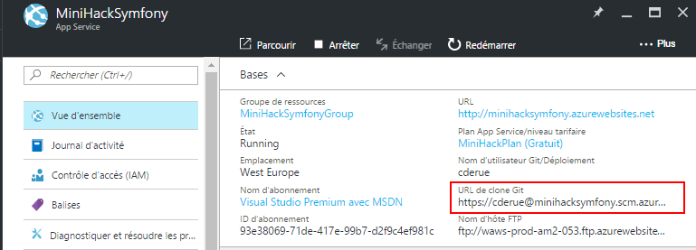

Si vous n'avez jamais déployé d'application web Azure à partir d'un référentiel Git local, il est nécessaire de renseigner les informations d'identification du référentiel Git local :
    - Dans la section __Déploiement des applications__ de l'application web, cliquez sur __Informations d'identification de déploiement__
    - Saisissez un nom d'utilisateur
    - Saisissez un mot de passe
    - Confirmez le mot de passe
    - Cliquez sur __Enregister__ pour valider les informations d'identification
        
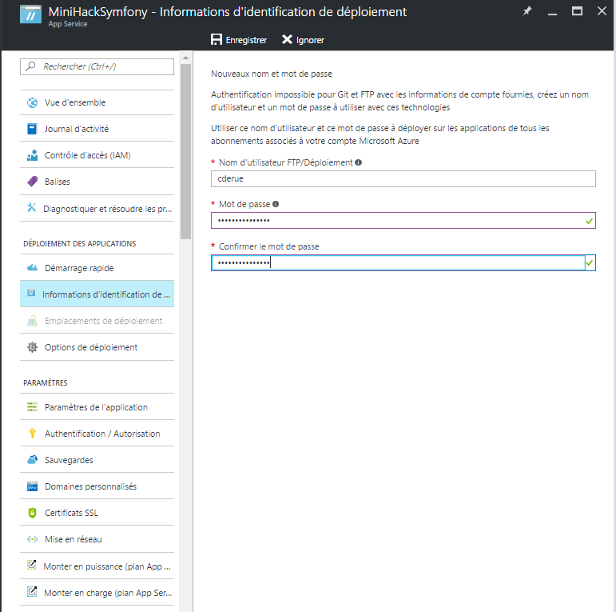

### 3.4) Déployer une application Symfony sur Azure

Maintenant que la source de déploiement est entièrement configurée, il est temps de déployer l'application PHP Symfony3 créée dans la section 3.
Juste avant cela, intéressons nous aux 3 fichiers contenus dans le répertoire __Sources__ du mini-hack :
- __web.config__
- __.deployment__
- __deploy.sh__

*Le fichier web .config :*
Ce fichier permet de définir les règles de réécriture des URL comme vous le feriez habituellement dans un fichier __.htaccess__. 
Ces règles sont nécessaires pour que l'application se comporte correctement lors de la navigation.

*Le fichier .deployment :*
Ce fichier permet de personnaliser le déploiement d'une application web sur Azure avec Azure App Service.
Dans cet exemple, le fichier __.deployment__ contient une instruction de configuration pour que le fichier __deploy.sh__ soit exécuté lors du déploiement.

*Le fichier deploy.sh :*
Ce fichier écrit en shell permet de scripter le déploiement de l'application. Le nom du fichier est important pour que le déploiement fonctionne (n'oubliez paz le point devant le nom).
Son utilisation n'est pas systématique lorsque l'on déploie des application web avec Azure App Service.
Néanmoins, pour une application PHP qui utilise le programme __composer__ pour installer les dépendances du projet d'application, le fichier __.deployment__ est obligatoire.

Pour procéder au déploiement de l'application :
- Copiez les fichiers __web.config__, __.deployment__ et __deploy.sh__ à la racine du projet d'application Symfony
- Exécutez les commandes suivantes depuis un terminal :

```bash
$ git init
$ git remote add azure <url_de_clonage_git_de>
$ git add .
$ git commit -m "Déploiement de l'application PHP Symfony3" 
$ git push azure master
```

*Le déploiement dure quelques minutes.*
*Une fois le déploiement terminé, lancez de nouveau l'application web Azure dans un navigateur pour observer le résultat.*


## 4) Générer une notification de déploiement avec Azure Functions

### 4.1) Quelques mots sur Azure Functions
Azure Functions est une technologie dite "event-driven" et "serverless".
Les fonctions Azure permet d'exécuter du code dans le cloud uniquement lorsque cela est nécessaire.
Nous serons donc facturés seulement à l’utilisation, c’est-à-dire lorsqu’il y aura un traitement effectif.
Dans ce mini-hack, il s'agit de mettre en place un service capable d'envoyer un mail de notification lorsque le déploiement de l'application est terminée.
Pour ce faire, nous allons utiliser conjointement Azure Functions et SendGrid.
La création de fonctions Azure est possible depuis [un portail dédié à Azure Functions] (https://functions.azure.com/signin) ou depuis le portail Azure.
Dans ce mini hack, nous utiliserons le portail Azure Functions. 

## 4.2) Créer un compte SendGrid et une clé d'API

Sendgrid est un service qui permet d’envoyer des emails via des API. 
Des SDK pour de nombreux langages comme C#, Ruby, NodeJS et PHP facilitent l'utilisation des API de SendGrid.
Sengrid est disponible depuis le Marketplace Azure et permet l'envoi de 25000 emails gratuits chaque mois.
Nous allons maintenant créer un compte SendGrid et une clé d'API pour pouvoir envoyer des emails depuis notre fonction Azure :
- Connectez-vous au portail Azure
- Cliquez sur __Nouveau__
- Dans la zone de recherche __Rechercher dans le marketplace__, saisissez __SendGrid__
- Tapez sur le touche __Entrée__ de votre clavier pour lancer la recherche

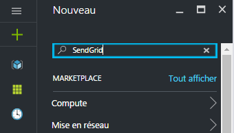

*Le Marketplace Azure trouve "SendGrid Email Delivery" dans les résultats de la recherche.*


- Cliquez sur __SendGrid Email Delivery__ dans les résultats de la recherche
- Dans la section __SendGrid Email Delivery__, cliquez sur __Créer__


- Renseignez les informations nécessaires pour la création du compte SendGrid :
    - Dans la zone de saisie __Name__, saisissez un nom de compte
    - Dans la zone de saisie __Password, saisissez un mot de passe
    - Dans la zone de saisie __Confirm Password, confirmez le mot de passe
    - Dans la zone de sélection __Abonnement__, sélectionnez l'abonnement Azure (dans le cas où vous possédez plusieurs comptes Azure)
    - Dans la zone __Groupe de ressources__, créez un nouveau groupe de ressources ou sélectionnez un groupe de ressources existant
    - Cliquez sur __Princing tiers__ puis sélectionnez l'offre __F1 Free__ et cliquez sur __Sélectionner__ pour valider le pricing
    


    - Cliquez sur __Contact Information__ et remplissez le formulaire de contact 
    


    - Cliquez sur __Termes et conditions__  et cliquez sur __Acheter__


    - Cochez la case __Epingler au tableau de bord__
    - Cliquez sur __Créer__ pour lancer la création du compte SendGrid
    
*Après quelques instants, le compte SendGrid est prêt et les informations générales du compte s'affiche dans le portail Azure.*

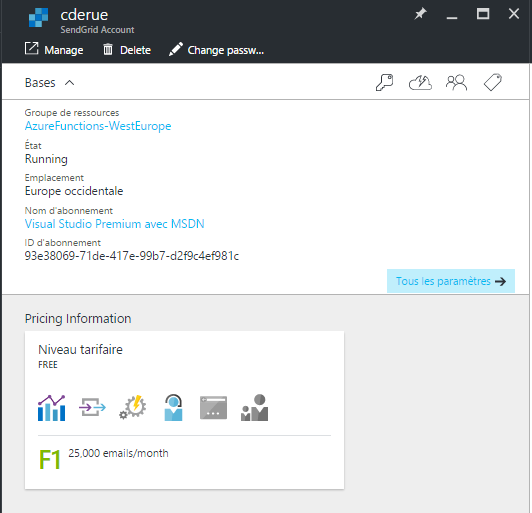

Nous allons maintenant nous connecter au portail SendGrid pour créer une clé d'API que nous utiliserons par la suite avec Azure Functions pour envoyer des emails.
- Cliquez sur __Manage__

*Le portail Azure nous redirige vers le portail SendGrid.*

- Dans le panneau gauche du portail SenGrid, cliquez sur __Settings > API Keys__
- En haut à droite du portail, cliquez sur __Create API Key__ puis sur __General API Key__


- Dans le formulaire de création d'une nouvelle API :
    - Saisissez un nom pour la nouvelle clé
    - Paramétrez les droits en sélectionnant __FULL ACCESS__ pour les sections __Mail Send__ et __Template Engine__
    - Cliquez sur __Save__ pour sauvegarder la nouvelle clé d'API
    
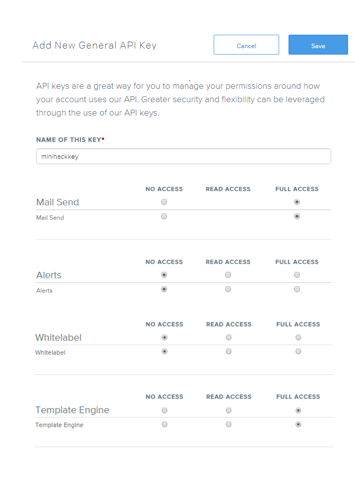

*SendGrid crée alors une nouvelle clé d'API et affiche la valeur de la clé.*

- Copiez la valeur de la clé d'API et collez-là dans un fichier texte


## 4.3) Créer un service d'envoi d'email avec Azure Functions

Pour initialiser un nouveau service avec Azure Functions :

- Connectez-vous à l'adresse au portail Azure Functions à l'adresse https://functions.azure.com/signin
- Dans la zone de saisie __Name, indiquez le nom la nouvelle fonction ou laissez le nom proposé par défaut
- Dans la zone de sélection __Region__, choisissez la localisation __West Europe__
- Cliquez sur __Create + get started__

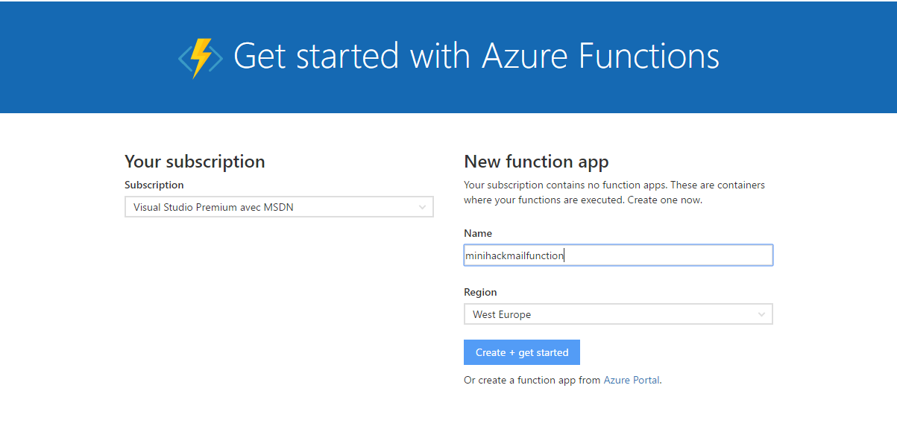

*L'initialisation de la nouvelle fonction prend quelques secondes.*
*Puis, une redirection vers le portail Azure se produit afin de demander à l'utilisateur les infos complémentaires pour terminer la création de la fonction.*

- Renseignez les informations nécessaires pour déterminer le type de fonction et le langage à utiliser :  
    - Cliquez sur __WebHook + API__
    - Sélectionnez __JavaScript__ comme langage de la nouvelle fonction
    - Cliquez sur __Créer cette fonction__

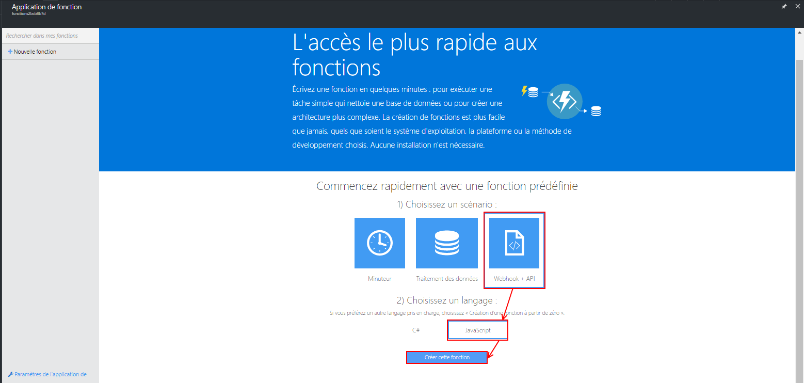

*Azure Functions génére une fonction Node.js prédéfinie.*

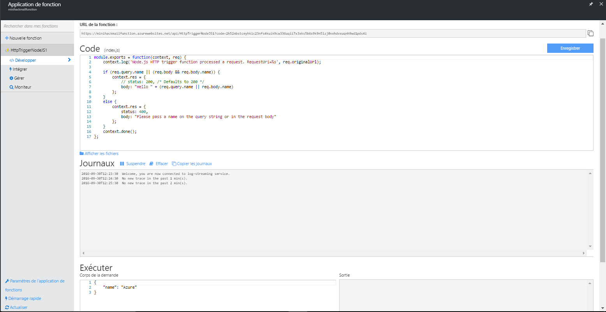

- Effacez le code généré par défaut et remplacez-le par le code ci-dessous : 

```javascript
module.exports = function(context, req) {
    var apiKey = "<Insérer la clé d'API SendGrid>";
    var mailFrom = "noreply@azurefunctions.com";
    var mailTo = "<Insérer votre email>";
    var helper = require('sendgrid').mail;
    var from_email = new helper.Email(mailTo);
    var to_email = new helper.Email(mailTo);
    var subject = "Azure deployment";
    var message = body.status;
    var content = new helper.Content('text/plain', message);
    var mail = new helper.Mail(from_email, subject, to_email, content);

    var sg = require('sendgrid')(apiKey);
      var request = sg.emptyRequest({
        method: 'POST',
        path: '/v3/mail/send',
        body: mail.toJSON(),
    });

  sg.API(request, function(error, response) {
    console.log(response.statusCode);
    console.log(response.body);
    console.log(response.headers);
  });
     
    context.done();
};
```

## 4.4) Installer SendGrid 

Pour que le code de notre fonction Azure puisse s'exécuter correctement, il faut installer le package NPM SendGrid.

Connectez-vous à l'adresse https://minihackmailfunction.scm.azurewebsites.net/DebugConsole

*Le navigateur affiche la console Kudu.*

- Dans la console affichée dans la page, exécutez la commande suivante pour naviguer jusqu'à la racine de l'application Azure Functions :

```bash
$ cd home\wwwroot
```

- Dans la zone d'arborescence des fichiers, cliquez sur le bouton [+] pour créer un nouveau fichier
- Nommez ce fichier __package.json__


- Cliquez sur l'icône "Crayon" du fichier __package.json__
- Ajoutez l'extrait de code suivant au fichier __package.json__
- Cliquez sur __Save__ pour sauvegarder les modifications 

```json
{
  "name": "azure-functions",
  "version": "1.0.0",
  "private": true,
  "dependencies": {
   "sendgrid": "^4.3.1"
  }
}
```


- Exécutez la commande suivante depuis la console Kudu (vérifiez que vous êtes bien dans le répertoire __site\wwwroot__) :

```bash
$ npm install
```

*Un dossier "node_modules" est créé dans le dossier courant avec le package "sendgrid" à l’intérieur.*
*Ce package sera utilisé depuis le code de notre fonction Azure.*

## 4.5) Créer un webhook vers le service d'envoi d'email

Pour appeler notre fonction Azure après chaque déploiement de l'application Symfony sur Azure, il es nécessaire de créer un Web Hook.
Pour faire nous allons nous connecter à la console Kudu de l'application web Azure créée dans la section 2 :
- Connectez-vous à l'adresse https://minihacksymfony.scm.azurewebsites.net/DebugConsole
- Dans le menu principal, cliquez sur __Tools > Web hooks__
- Dans le champ de saisie __Subscriber URL__, copiez-collez l'URL de la fonction Azure d'envoi d'emails
- Sélectionnez __Post Deployment__
- Cliquez sur __Add URL__ pour valider l'ajout du web hook

*Une nouvelle URL apparaît maintenant dans la liste des web hooks.*

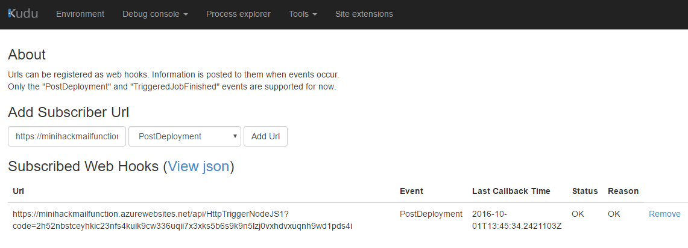

## 4.3) Modifier le code source de l'application Symfony

Nous sommes arrivés à l'ultime étape de ce mini-hack qui va nous permettre de tester si notre fonction Azure d'envoi d'emails fonctionne correctement.

Pour cela nous allons modifier le code source de l'application Symfony créée en local dans la section 3) de ce mini-hack :
- Editez le fichier le fichier __app/Resources/views/default/index.html.twig__
- Modifiez le code source de la balise __div__ avec l'id "welcome" comme ci-dessous :

```html
<div id="welcome">
    <h1><span>Welcome to</span> Symfony on <span style="color:#00BCF2">Azure</span> {{ constant('Symfony\\Component\\HttpKernel\\Kernel::VERSION') }}</h1>
</div>
```

*Cette modification du code va donc changer le titre "Welcome to Symfony" en "Welcome to Symfony on Azure" une fois l'application publiée sur Azure.**

- Exécutez les commandes suivantes depuis un terminal :

```bash
$ git add app/Resources/views/default/index.html.twig
$ git commit -m "Modification du titre" 
$ git push azure master
```

Le déploiement prend quelques secondes. Une fois celui-ci terminé, nous devons observer le résultat suivant :

- La réception d'un email indiquant le fin du déploiement de l'application


- L'affichage du titre "Welcome to Symfony on Azure" après rafraichissement de l'application web Azure dans le navigateur

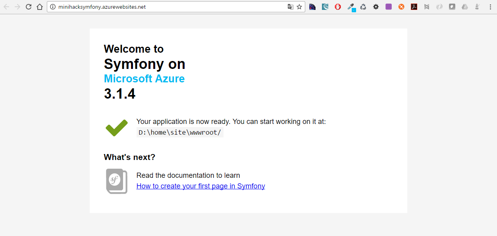

C'est terminé ! Pensez à valider votre mini-hack, il y a des cadeaux à gagner !

## Pour aller plus loin

Ces parties sont optionnelles dans le cadre du mini-hack, mais voici quelques idées pour aller plus loin :

- [Ajouter une base de données MySQL avec MySQL In App](MySQL in-app/README.md)
- [Personnaliser le déploiement d'une application web Azure avec Kudu](https://azure.microsoft.com/en-us/documentation/videos/custom-web-site-deployment-scripts-with-kudu/)


